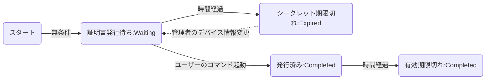

# Verify- A Admin

  

SCEPサーバー(https://github.com/Tasuku-Sasaki-lab/scep) に関連し、ユーザーとsecret等を管理する画面

## DEMO


 	

## UseCase and FlowChart




## Environment


* GCP e2-standard-2（開発者のマシン）
* MongoDB shell version v4.0.28

## Usage

* Mongoの起動　
　(https://www.mongodb.com/)

* レポジトリをクローン

  

```bash

git clone git@github.com:Tasuku-Sasaki-lab/Verify-Admin.git
cd Verify-Admin

```

* 環境変数の設定

```bash

cd devices-server
vim .env

```


```bash

DB_URL="mongodb://localhost:27017/devices_db"
export DB_URL
JWT_KEY="hoge0123456789"
export JWT_KEY
JWT_EXPIRATION="28800"
export JWT_EXPIRATION
SIGNER="test@com"
export SIGNER
SCEP_SERVER="http://127.0.0.1:2016/scep"
export SCEP_SERVER
COMMAND="./scepclient-linux-amd64"
export COMMAND
CERTIFICATE="/etc/pki/tls/certs/nssdc.crt"
export CERTIFICATE
PRIVAE_KEY="/etc/pki/tls/private/nssdc.key"
export PRIVAE_KEY
EXPIRATION_TERM_SE="3" 
export EXPIRATION_TERM_SE
EXPIRATION_TERM_SYSTEM="6" 
export EXPIRATION_TERM_SYSTEM
TZ="JST-9"
export TZ


```
|環境変数名|詳細|デフォルト値|
|:--:|--|:--:|
|DB_URL|形式は、例えばlocalhost、port番号が27017、DBの名前がdevices_dbの場合、mongodb://localhost:27017/devices_db　となります。|なし|
|JWT_KEY|JWTの秘密鍵です。|なし|
|JWT_EXPIRATION|このサーバーが発行するJWTの有効期間です。|28800(8h)|
|SIGNER|JWTの発行者のメールアドレスです。|なし|
|SCEP_SERVER|SCEPサーバーのURLです。|なし|
|COMMAND|証明書を取得するためのコマンドです。|./scepclient-linux-amd64|
|CERTIFICATE|証明書のファイル名です。|/etc/pki/tls/certs/nssdc.crt|
|PRIVAE_KEY|公開鍵のファイル名です。|/etc/pki/tls/private/nssdc.key|
|EXPIRATION_TERM_SE|SE向けの証明書の有効期間です。|3(y)|
|EXPIRATION_TERM_SYSTEM|システム向けの証明書の有効期間です。|6(y)|
|TZ|タイムゾーンの設定です。|環境による|


* サーバーの立ち上げ


  

```bash

source ./.env
npm install
npm start

```

  

* クライアントの立ち上げ

  

```bash

cd devices-client
npm install
npm start

```

  

* mongoに管理者を手動で登録

  

```bash

mongo

use devices_db

db.users.insert({"email":"test@com","pass":"hogehoge","role":"administrator"})
db.users.insert({"email":"test2@com","pass":"hogehoge","role":"user"})

```

  

（http://localhost:3000/) にアクセス

## Features

### DB構造
 * db : devices_db
 * collection1 : users
 * collection2 : devices
 
 #### userss : 
 
```bash

	usersSchema = new Schema({
    email:{type:String,reqiured:true,unique: true},
    pass:{type:String,reqiured:true},
    role :{type:String,required:true} //0:admin 1:user
});
	
```
	
 #### devices :
 
```bash
	
	devicesSchema = new Schema({
    csrGroup:{type:Number,reqiured:true},
    CN:{type:String,reqiured:true},
    email:{type:Array,reqiured:true},
    type:{type:String,reqiured:true},
    secret:{type:String,reqiured:true},
    status:{type:String,reqiured:true},
    expiration_date:{ type: Date, required:true},
    pem:{type:String},
    command:{type:String}
});

	
```
	


  

## Note
  
* APIでのDBの更新を後々開発します。


## TEST 


* レポジトリをクローン

  

```bash

git cloen git@github.com:Tasuku-Sasaki-lab/Verify-Admin.git
cd Verify-admin

```

* Mongoの起動　(https://www.mongodb.com/)
*  環境変数の設定


```bash

cd devices-server
vim .env

```

テスト用のDB_URLは固定です。下記から変更しないでください。DB_URL以外はお好みに変更していただいても問題ありません。

```bash
DB_URL="mongodb://localhost:27017/devices_db"
export DB_URL
JWT_KEY="hoge0123456789"
export JWT_KEY
JWT_EXPIRATION="28800"
export JWT_EXPIRATION
SIGNER="test@com"
export SIGNER
SCEP_SERVER="http://127.0.0.1:2016/scep"
export SCEP_SERVER
COMMAND="./scepclient-linux-amd64"
export COMMAND
CERTIFICATE="/etc/pki/tls/certs/nssdc.crt"
export CERTIFICATE
PRIVAE_KEY="/etc/pki/tls/private/nssdc.key"
export PRIVAE_KEY
EXPIRATION_TERM_SE="3" 
export EXPIRATION_TERM_SE
EXPIRATION_TERM_SYSTEM="6" 
export EXPIRATION_TERM_SYSTEM
TZ="JST-9"
export TZ
```

```bash

source .env

```

*  サーバー側の起動


```bash

npm start

```

*  テスト環境の構築
```bash

cd ../test
pip install -r requirements.txt
source ../devices-server/.env

```
*  実行
```bash

python3 testDevices-server.py

```
  

## Author

* Tasuku Sasaki

*  株式会社　プロキューブ

* t.sasaki.revol@gmail.com
